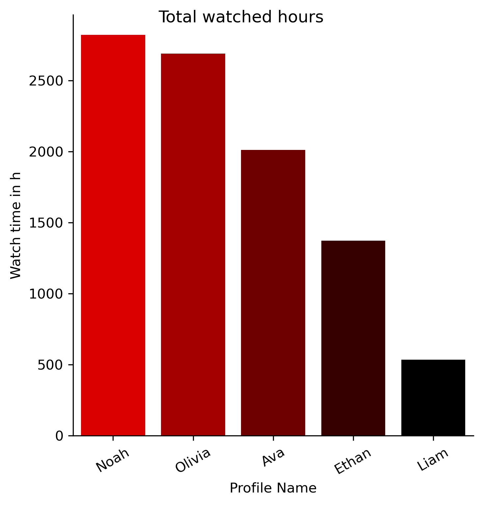

# Netflix Data Analysis

Analyze your *own* Netflix data and find out who in your family spends the most time streaming.
For example, compare who has spent the most hours on Netflix or how the average hours per year differ.
In addition, many evaluations are carried out at the profile level, such as the monthly hours spent on Netflix over the years and much, much more.

<p float="left">
  
  
</p>


## Get your own data

Log in to Netflix in your browser and go to your account settings and [request your personal information](https://www.netflix.com/account/getmyinfo).
Getting your data can take up a few hours, and you will be notified by email when your data is ready to download.
In the meantime you can clone this repository and set everything up.


## Setup
### Data
Once your data is ready, download the zip file and unzip the contents into the `data` folder of this repo.
The folder structure could then look as follows. 
Make sure that the file `ViewingActivity.csv` is located somewhere in the `data` folder -- the code will automatically find it. 

```bash
.
├── data
│   ├── ACCOUNT
│   │   ├── AccountDetails.csv
│   │   └── ...
│   ├── CLICKSTREAM
│   │   └── Clickstream.csv
│   ├── CONTENT_INTERACTION
│   │   ├── IndicatedPreferences.csv
│   │   ├── ViewingActivity.csv
│   │   └── ...
│   ├── CUSTOMER_SERVICE
│   │   ├── ChatTranscripts.txt
│   │   └── ...
│   └─── ... 
├── README.md
├── requirements.txt
├── results
└── src
    ├── analyze_netflix.py
    └── __init__.py
```

### Python

It is best practice to create a Python environment with conda, for example.

```bash
conda create -n netflix python=3.10
```

Activate the environment.

```bash
conda activate netflix
```
And install the required Python packages.

```bash
pip install -r requirements.txt
```

## Analyze your data

Analysis of your own Netflix data is as simple as running the Python script.

```bash
python src/analyze_netflix.py
```

This creates several PNG files in the `results` folder showing different evaluations of the Netflix data.

